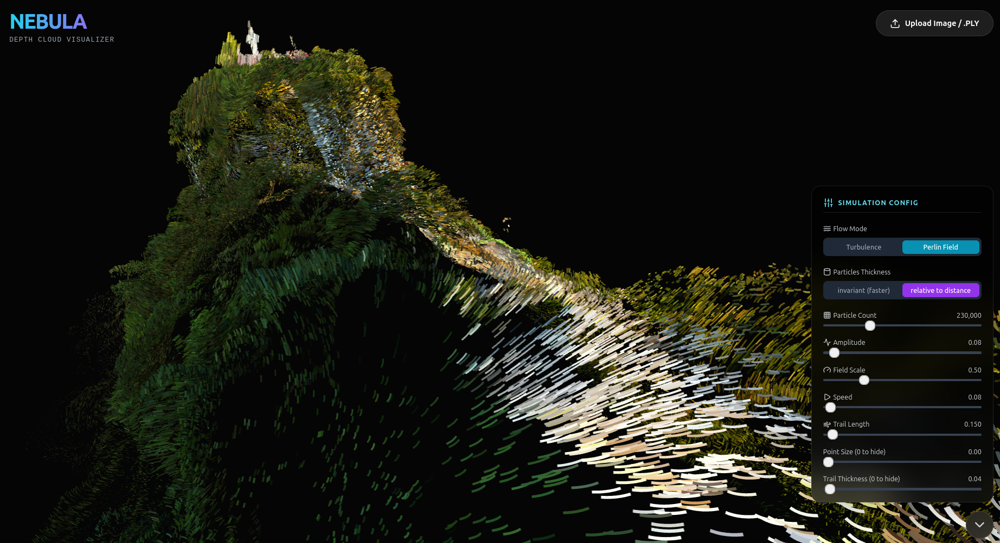

<div align="center">
  
  <h1>Nebula Depth Cloud</h1>
  <p><strong>Transform images into stunning 3D particle visualizations with real-time shader effects</strong></p>

  <p>
    <a href="https://brunwo.github.io/nebula-depth-cloud/">
      
    </a>
    <a href="#features">
      
    </a>
    <a href="#installation">
      
    </a>
  </p>
</div>

---

## 🌟 Features

### 🎨 **Dual Input Modes**
- **Image Mode**: Upload any image and generate depth maps using AI
- **PLY Mode**: Direct visualization of existing .PLY point cloud files

### ✨ **Advanced Shader Effects**
- **Flow Modes**: Switch between Turbulence and Perlin Field noise
- **Real-time Animation**: Dynamic particle movement with customizable parameters
- **Trail Effects**: Variable trail thickness and length
- **Speed Variation**: Particle-by-particle speed randomization
- **Time Controls**: Adjustable animation timing and randomization

### 💡 **Light Emission System** ✨
- **Percentage Control**: Set what percentage of particles emit light (0-100%)
- **Selection Modes**:
  - **Brightness**: Brighter particles emit light preferentially
  - **Random**: Stable random selection per particle
- **Visual Effects**: Emitting particles appear brighter with subtle desaturation

### 🎛️ **Comprehensive Controls**
- **Noise Parameters**: Amplitude, speed, scale, and blend controls
- **Particle Settings**: Count, color, size, and trail thickness
- **Camera Controls**: World up axis detection and manual override
- **Color Filtering**: Filter particles by color in PLY files

## 🚀 Installation & Usage

### Prerequisites
- Node.js (v16+ recommended)
- npm or yarn
- Hugging Face API key (for image depth generation)

### Quick Start

1. **Clone the repository:**
   ```bash
   git clone https://github.com/Brunwo/nebula-depth-cloud.git
   cd nebula-depth-cloud
   ```

2. **Install dependencies:**
   ```bash
   npm install
   ```

3. **Set up API key:**
   - Copy `.env.local.example` to `.env.local`
   - Add your Hugging Face API key: `HF_API_KEY=your_key_here`

4. **Run locally:**
   ```bash
   npm run dev
   ```

5. **Open your browser** to `http://localhost:3000`

### 🌐 Live Demo
Visit the deployed application: **[https://brunwo.github.io/nebula-depth-cloud/](https://brunwo.github.io/nebula-depth-cloud/)**

## 🎮 How to Use

### Image Mode
1. Click "Upload Image / .PLY" or drag & drop an image
2. The AI will generate a depth map automatically
3. Adjust parameters using the control panel
4. Watch your image transform into a 3D particle cloud!

### PLY Mode
1. Upload a .PLY point cloud file
2. Optionally filter particles by color
3. Customize animation and lighting effects
4. Export or share your visualization

### Light Emission Controls
- Use the **Light Emission** slider to set emission percentage
- Choose **Brightest** for natural lighting or **Random** for artistic effects
- Combine with other parameters for unique visual effects

## 🛠️ Technical Details

### Built With
- **React 19** - Modern React with hooks and concurrent features
- **Three.js** - 3D graphics and WebGL rendering
- **React Three Fiber** - React renderer for Three.js
- **Vite** - Fast build tool and development server
- **Tailwind CSS** - Utility-first CSS framework
- **TypeScript** - Type-safe JavaScript

### Shader System
- **Custom GLSL Shaders**: Optimized vertex and fragment shaders
- **Real-time Rendering**: GPU-accelerated particle animation
- **Perlin Noise**: Procedural noise generation for organic movement
- **Advanced Lighting**: Custom light emission calculations

### Architecture
- **Modular Components**: Separated concerns for image and PLY processing
- **Shader Management**: Efficient shader compilation and uniform updates
- **Performance Optimized**: WebGL instancing and efficient rendering pipelines

## 📁 Project Structure

```
nebula-depth-cloud/
├── components/           # React components
│   ├── PointCloud.tsx    # Image-based particle clouds
│   ├── PlyPointCloud.tsx # PLY file visualization
│   ├── Scene.tsx         # Three.js scene management
│   ├── UI.tsx            # Control panel interface
│   └── ...
├── services/             # API and utility services
├── utils/                # Shader utilities and helpers
├── types.ts              # TypeScript type definitions
└── vite.config.ts        # Build configuration
```

## 🤝 Contributing

1. Fork the repository
2. Create a feature branch: `git checkout -b feature/amazing-feature`
3. Commit your changes: `git commit -m 'Add amazing feature'`
4. Push to the branch: `git push origin feature/amazing-feature`
5. Open a Pull Request

## 📄 License

This project is open source and available under the [MIT License](LICENSE).

## 🙏 Acknowledgments

- **Hugging Face** for the depth estimation API
- **Three.js** community for excellent 3D graphics tools
- **React** ecosystem for modern web development tools

---

<div align="center">
  <p><strong>Transform any image into a mesmerizing 3D particle experience! ✨</strong></p>
  <p>Built with ❤️ using modern web technologies</p>
</div>
